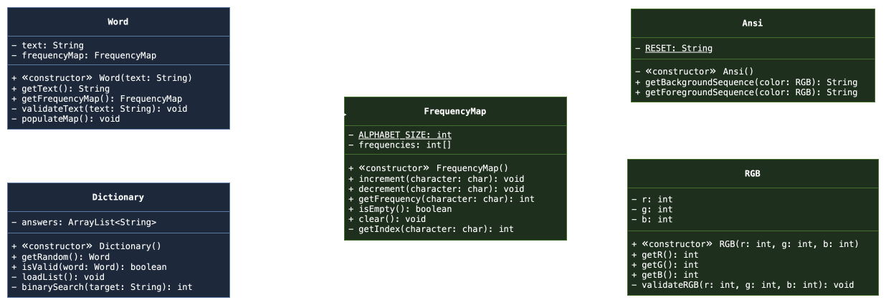

## Basic "Wordle" Java ##
A simple Java-based implementation of the popular word-guessing game, Wordle. The project offers a simple CLI with no
actual GUI, while focusing heavily on OOP principles to handle game logic and state, and custom Data Structures to
optimize performance.

### 🚧 Status ###
**Work in Progress** - Implementing the View layer and console interface.

### 🎯 Goals ###
1. **Apply OOP Concepts** - Strict encapsulation, class relationships, and abstraction.
2. **Implement Basic Data Structures** - Custom and specialized Hash Tables to improve performance.
3. **Use MVC Architecture** - Professional structure for large projects.
4. **Write Clean and Documented Code** - Provide detailed and easy-to-read documentation.

### 📁 Diagram ###
**Unified UML Class Diagram** -<br>


### ✏️ Additions ###
**Commits** - To see the latest features, fixes, and updates, please check the [commit history](https://github.com/actuallyhollow/basic-wordle-java/commits/main).

### 🎮 Rules ###
**Rules of Play**
* You have exactly 6 attempts to guess a randomly selected hidden 5-letter word.
* Each guess inputted must be a valid 5-letter word from the game's internal dictionary.
* After each submitted guess, a visual feedback will indicate how close your letters are to the hidden word.

**Feedback Indicators**
* **[🟩 Exact Match]:** The letter is in the hidden word, and in the correct position.
* **[🟨 Partial Match]:** The letter is in the hidden word, but in the wrong position.
* **[⬛ Incorrect]:** The letter does not exist in the hidden word in any position.

**Game End States**
* **Victory:** Correctly guessing the 5-letter word before or on the 6th attempt.
* **Defeat:** Exhausting all 6 attempts without matching the hidden word.

### 🚀 Compiling ###
1. **Environment** - JDK 17 or higher, an IDE (VS Code, IntelliJ, Eclipse).
2. **Clone Repository** -
```bash
git clone https://github.com/actuallyhollow/basic-wordle-java.git
cd basic-wordle-java
```
3. **Compile and Run** -
```bash
javac -d bin src/main/java/com/omaridris/wordle/Main.java
java -cp bin com.omaridris.wordle.Main
```

### 🛠️ Structure ###
```diff
 basic-wordle-java/
 |---.vscode/                                               # Local editor configuration (ignored)
 |   |---settings.json
 |---assets/                                                # Documentation media
 |   |---wordle-answers-alphabetical.txt
 |   |---wordle-class-diagram.drawio
 |   |---wordle-class-diagram.svg
 |---bin/                                                   # Compiled .class files (ignored)
 |---lib/                                                   # External dependencies (optional)
 |---|---junit-platform-console-standalone-6.1.0.jar
+|---|---system-lambda-1.2.1.jar
 |---src/
 |   |---main/java/com/omaridris/wordle/
 |   |   |---controller/                                    # Game logic and turn management
 |   |   |---model/                                         # Custom datatypes and game state
 |   |   |---|---Dictionary.java
 |   |   |---|---Word.java
 |   |   |---utilities/                                     # Helper structures
 |   |   |---|---Ansi.java
 |   |   |---|---FrequencyMap.java
 |   |   |---|---RGB.java
 |   |   |---view/                                          # I/O and CLI
+|   |   |---|---Renderer.java
 |   |   |---Main.java                                      # Entry point
 |   |---test/java/com/omaridris/wordle/
 |   |   |---controller/                                    # Game logic tests
 |   |   |---model/                                         # Custom datatypes tests
 |   |   |---|---DictionaryTest.java
 |   |   |---|---Word.java
 |   |   |---utilities/                                     # Helper structures tests
 |   |   |---|---AnsiTest.java
 |   |   |---|---FrequencyMapTest.java
 |   |   |---|---RGBTest.java
 |   |   |---view/                                          # I/O and CLI tests
+|   |   |---|---RendererTest.java
 |---.gitignore
 |---LICENSE
 |---README.md
```

### 📖 Credits ###
* **Author:** Omar Idris
* **GitHub:** [@actuallyhollow](https://github.com/actuallyhollow)
* **License** - check the [LICENSE](LICENSE) file for details.