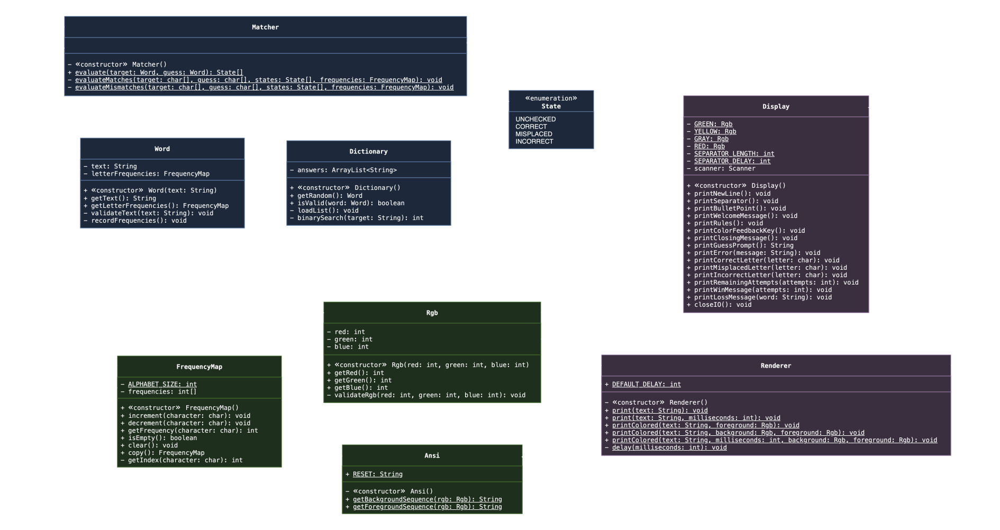
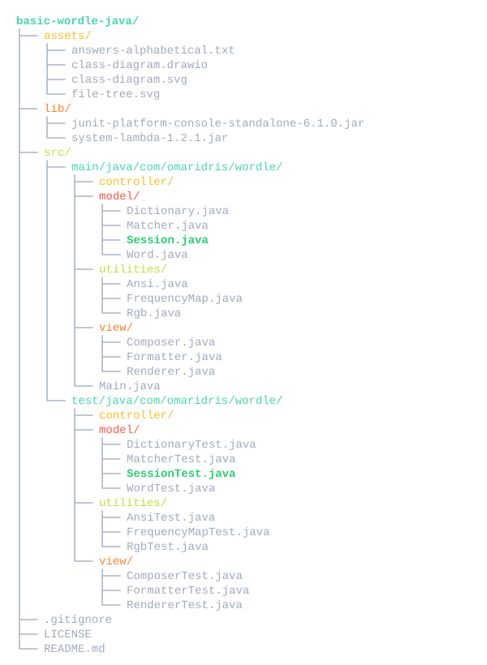

## Basic "Wordle" Java ##
A simple Java-based implementation of the popular word-guessing game, Wordle. The project offers a simple CLI with no
actual GUI, while focusing heavily on OOP principles to handle game logic and state, and custom Data Structures to
optimize performance.

### 🚧 Status ###
**Work in Progress** - Implementing the View layer and console interface.

### 🎯 Goals ###
1. **Apply OOP Concepts** - Strict encapsulation, class relationships, and abstraction.
2. **Implement Basic Data Structures** - Custom and specialized Hash Tables to improve performance.
3. **Use MVC Architecture** - Professional structure for large projects.
4. **Write Clean and Documented Code** - Provide detailed and easy-to-read documentation.

### 📁 Diagram ###
**Unified UML Class Diagram** - Optimized for dark-themed environments.<br>


### ✏️ Additions ###
**Commits** - To see the latest features, fixes, and updates, please check the [commit history](https://github.com/actuallyhollow/basic-wordle-java/commits/main).

### 🎮 Rules ###
**How to Play**
* **Make a Guess** - You have exactly 6 attempts to guess the hidden 5-letter word.
* **Submit Valid Words** - Each guess must be a valid word from the game's internal dictionary.
* **Receive Visual Clues** - Colored feedback will indicate how close your letters are to the hidden word.

**Feedback Indicators**
* **🟩 Exact Match** - The letter is in the hidden word, and in the correct position.
* **🟨 Partial Match** - The letter is in the hidden word, but in the wrong position.
* **⬛ Incorrect** - The letter does not exist in the hidden word in any position.

**Game End States**
* **Victory** - Correctly guessing the 5-letter word before or on the 6th attempt.
* **Defeat** - Exhausting all 6 attempts without matching the hidden word.

### 🚀 Compiling ###
**Setup** - Requires JDK 17 or higher, an IDE (VS Code, IntelliJ, Eclipse).
```bash
# 1. Clone repository and navigate
git clone https://github.com/actuallyhollow/basic-wordle-java.git
cd basic-wordle-java

# 2. Compile and run
javac -d bin -sourcepath src/main/java src/main/java/com/omaridris/wordle/Main.java
java -cp bin com.omaridris.wordle.Main
```

### 🛠️ Structure ###
**Project File Tree** - Optimized for dark-themed environments.<br>


### 📖 Credits ###
* **Author** - Omar Idris
* **GitHub** - [@actuallyhollow](https://github.com/actuallyhollow)
* **License** - check the [LICENSE](LICENSE) file for details.